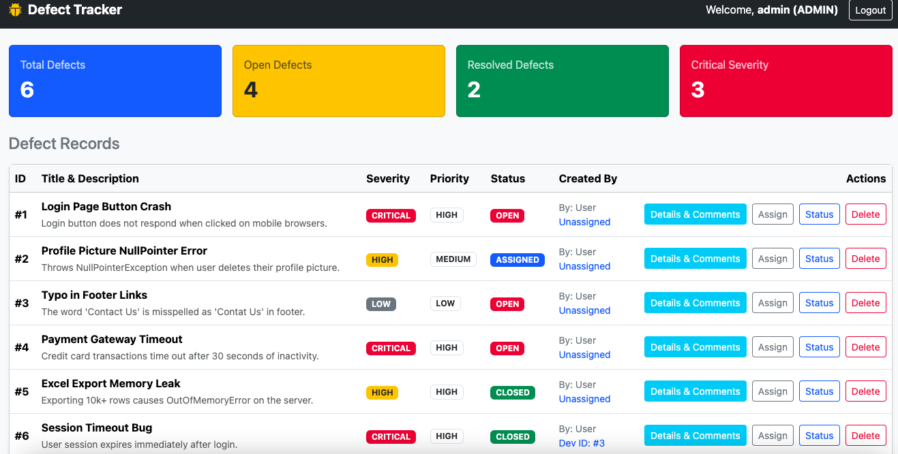
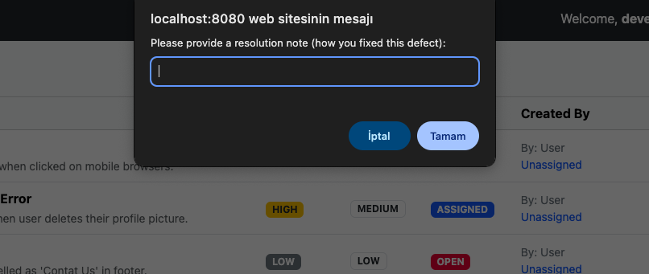
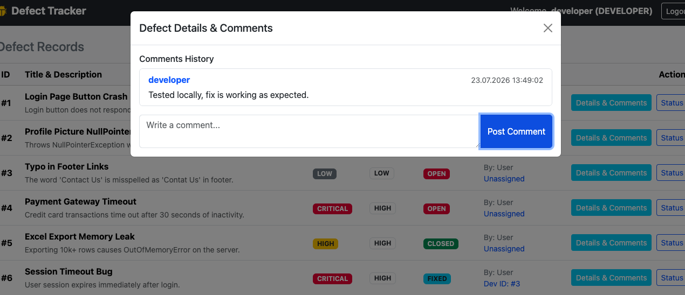

# Defect Tracking System

## Project Description

Defect Tracking System is a full-stack web application designed to manage software defects through a structured lifecycle. The application enforces Role-Based Access Control (RBAC), strict business rule validation, dynamic filtering, and automated audit logging for system transparency.

---

## Technologies

* **Backend:** Java 21, Spring Boot 3.3.1, Spring Security, JWT
* **Persistence & Logging:** Spring Data JPA, H2 In-Memory Database, Spring AOP
* **Frontend:** HTML5, CSS3, Bootstrap 5, Vanilla JavaScript (Fetch API)
* **Testing & API Docs:** JUnit 5, Mockito, Swagger UI / OpenAPI 3, Postman

---

## User Roles & Credentials

The system provides tailored permissions and interface controls based on user roles:

| Role | Username | Password | Key Responsibilities & Capabilities |
|---|---|---|---|
| **Admin** | admin | 1234 | Full system oversight, views high-level dashboard metrics, manages user assignments, and deletes defects. |
| **Developer** | developer | 1234 | Reviews assigned defects, updates status to `FIXED` with mandatory resolution notes, and adds technical comments. |
| **Tester** | tester | 1234 | Creates new defects, assigns them to developers, verifies resolved issues, and transitions defects to `CLOSED`. |

---

## Key Highlights & Interface

### 1. Admin Dashboard Metrics
Provides summary metrics including Total, Open, Resolved, and Critical defects.

### 2. Mandatory Resolution Notes
Enforces strict business rules requiring developers to provide a resolution note when transitioning a defect status to `FIXED`.

### 3. Defect Lifecycle & Comments
Supports end-to-end defect management (`OPEN` -> `ASSIGNED` -> `FIXED` -> `VERIFIED` -> `CLOSED`) alongside team comments.

---

## Core Features & Workflow

✔ **JWT Authentication:** Secures API endpoints using JSON Web Tokens.  
✔ **Role-Based Access Control (RBAC):** Dynamic UI rendering tailored for `ADMIN`, `DEVELOPER`, and `TESTER` roles.  
✔ **Defect Lifecycle Management:** Enforces strict transition rules between defect statuses.  
✔ **Audit Logging (Spring AOP):** Automatically tracks defect status modifications and user actions.  
✔ **Dynamic Defect Filtering:** Supports filtering by status, priority, and severity.  
✔ **Database Persistence:** Operates seamlessly on an H2 In-Memory Database.

---

## Installation & Running

1. Open the project in your IDE with **JDK 21** configured.
2. Run `DefectTrackingApplication.java`.
3. Open `http://localhost:8080/index.html` in your browser.
4. Log in using one of the default credentials listed above.

---

## Documentation & Tools

* **Swagger UI:** `http://localhost:8080/swagger-ui/index.html`
* **H2 Console:** `http://localhost:8080/h2-console` *(JDBC URL: `jdbc:h2:mem:defectdb`)*
* **Postman Collection:** `Defect Tracking API.postman_collection.json`